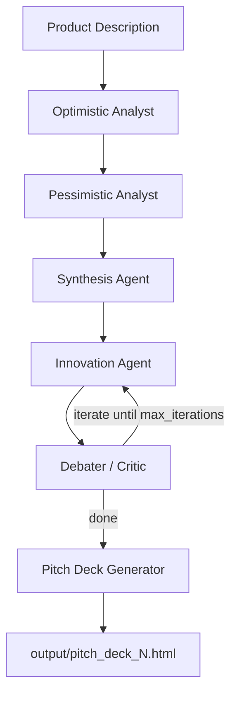

# 🚀 Startup Pitch Deck

An **AI-powered multi-agent system** that turns a one-paragraph product idea into a full market research report and a styled, presentation-ready HTML pitch deck.

The project orchestrates a team of specialized LLM agents with [LangGraph](https://langchain-ai.github.io/langgraph/). Agents debate each other (optimist vs. pessimist vs. critic), research the web autonomously, and finally generate a polished slide deck as a self-contained HTML file.

---

## ✨ How It Works

Given a plain-text product description, the pipeline runs:



1. **Optimistic market analysis** — identifies opportunities, target segments, competitive advantages, and growth signals (uses `web_search` to ground claims).
2. **Pessimistic market analysis** — surfaces risks, barriers to entry, competitive threats, regulatory issues, and failure modes.
3. **Synthesis** — merges both perspectives into one balanced, concise market view (≤ 200 words).
4. **Innovation proposal** — proposes differentiated, feasible product features that address the market reality and the previous critique.
5. **Debate / critique loop** — a critical debater attacks the proposal on feasibility, resources, and market assumptions. The loop repeats `max_iterations` times, each round refining the proposal.
6. **Pitch deck generation** — a larger model plans the slide structure (8–10 slides), then generates each slide individually using Tailwind CSS, Font Awesome icons, animations, and real images fetched from Pexels. Everything is assembled into a single HTML file.

---

## 📁 Project Structure

```
Startup-pitch-deck/
├── main.py                                  # Entry point – runs the workflow end-to-end
├── requirements.txt
├── agents/
│   ├── market_analyst/
│   │   ├── optimistic_analyst.py            # Bull-case market analysis (+ web search)
│   │   ├── pessimistic_analyst.py           # Bear-case market analysis (+ web search)
│   │   └── synthesis_agent.py               # Balances both views
│   ├── innovation/
│   │   ├── innovation_agent.py              # Proposes product features
│   │   └── debater_agent.py                 # Critiques & drives the iteration loop
│   └── pitch_deck/
│       └── pitch_deck.py                    # Plans slides & generates slide HTML
├── graphs/
│   └── market_research_graph.py             # LangGraph wiring, nodes, edges, iteration control
├── states/
│   └── agent_state.py                       # MarketResearchState (Pydantic shared state)
├── tools/
│   ├── web_search.py                        # DuckDuckGo search tool
│   ├── image_search.py                      # Pexels image search tool
│   ├── save_pitch_deck_html.py              # Renders slides into the HTML template
│   └── save_pitch_deck_ppt.py               # Alternate PowerPoint (.pptx) exporter
├── templates/
│   └── pitch_deck_template.html             # Shell (CDNs, Tailwind config, keyboard nav)
└── output/                                  # Generated decks (pitch_deck_1.html, ...)
```

### Shared state

All agents read and write a single Pydantic model, `MarketResearchState` (`states/agent_state.py`):

| Field                                                               | Purpose                                    |
| ------------------------------------------------------------------- | ------------------------------------------ |
| `product_description`                                               | Input idea                                 |
| `groq_api_key`                                                      | Groq credentials                           |
| `optimistic_analysis` / `pessimistic_analysis` / `market_synthesis` | Market research outputs                    |
| `current_proposal` / `current_critique`                             | Innovation round-trip                      |
| `final_innovation`                                                  | Reserved for the final proposal            |
| `iteration_count`                                                   | Loop counter vs. `max_iterations`          |
| `pitch_deck` / `pitch_deck_html`                                    | Generated slide markup and saved file path |

---

## 🛠️ Tech Stack

| Layer              | Technology                                                               |
| ------------------ | ------------------------------------------------------------------------ |
| Orchestration      | `langgraph` (StateGraph, conditional edges)                              |
| LLM                | Groq — `llama-3.1-8b-instant` (agents), `llama-3.3-70b-versatile` (deck) |
| LLM framework      | `langchain`, `langchain-groq`, `langchain-community`                     |
| Validation / state | `pydantic`                                                               |
| Web search         | DuckDuckGo (`DuckDuckGoSearchRun`)                                       |
| Images             | Pexels API                                                               |
| Slides             | Tailwind CSS, Font Awesome, Chart.js, AOS, GSAP (via CDN)                |
| Export             | `python-pptx` (optional PowerPoint path)                                 |

---

## ⚙️ Setup

### 1. Install dependencies

```bash
python -m venv .venv
source .venv/bin/activate      # Windows: .venv\Scripts\activate
pip install -r requirements.txt
```

### 2. Configure environment variables

Create a `.env` file in the project root:

```env
GROQ_API_KEY=your_groq_api_key_here
PEXELS_API_KEY=your_pexels_api_key_here
```

| Variable         | Required       | Where to get it                                                                  |
| ---------------- | -------------- | -------------------------------------------------------------------------------- |
| `GROQ_API_KEY`   | ✅ Yes         | https://console.groq.com/keys                                                    |
| `PEXELS_API_KEY` | ⚠️ Recommended | https://www.pexels.com/api/ — without it, slides fall back to placeholder images |

### 3. Run

```bash
python main.py
```

The workflow logs each stage to the console (market analyses, critiques, slide-by-slide progress, and content stats) and writes the finished deck to:

```
output/pitch_deck_1.html
output/pitch_deck_2.html   # each run increments the number
```

Open the file in any browser — it is fully self-contained (CDN-based) and supports keyboard/arrow navigation between slides.

---

## 📝 Customizing

**Change the idea.** Edit `product_description` in `main.py` — currently an example about a self-service perfume dispenser.

**Change debate depth.** Pass `max_iterations` to the workflow call in `main.py` (default `2`; the graph default is `3`). More iterations = more refined innovation, more tokens, longer runtime.

**Change models / temperature.** Each agent constructs its own `ChatGroq` client, so you can tune model and `max_tokens` per role (e.g. keep synthesis short while giving the pitch deck a bigger budget).

**Slide count and layout.** `agents/pitch_deck/pitch_deck.py` contains the planning prompt (slide structure) and the per-slide generation prompt (layouts, colors, CDNs, image rules).

**Look and feel.** Branding, fonts, Tailwind theme extensions, and navigation logic live in `templates/pitch_deck_template.html`.

**Export to PowerPoint.** `tools/save_pitch_deck_ppt.py` converts structured JSON slide data into a `.pptx`. It is not wired into the graph yet — call it with a JSON payload like:

```json
{
	"slides": [
		{
			"title": "Problem",
			"content": ["point 1", "point 2"],
			"notes": "speaker note"
		}
	]
}
```

---

## 🔍 Notes & Limitations

- **Groq rate limits** apply — the deck generator makes several sequential calls, one per slide.
- All agents use **8B `llama-3.1-8b-instant`**; the deck generator uses **70B `llama-3.3-70b-versatile`** for better layout/HTML quality.
- Image results depend on `PEXELS_API_KEY`; if it is missing, a hardcoded placeholder URL is substituted.
- Generated HTML relies on public CDNs (Tailwind, Font Awesome, AOS, GSAP), so an internet connection is needed to view a deck.
- Output HTML is LLM-generated; review content before using it with investors.
